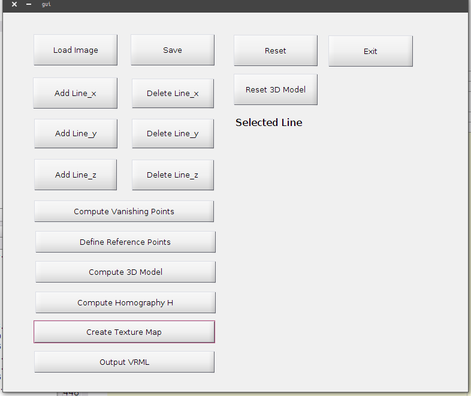
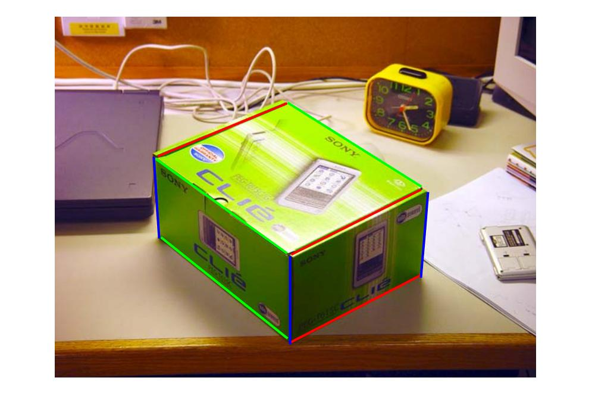
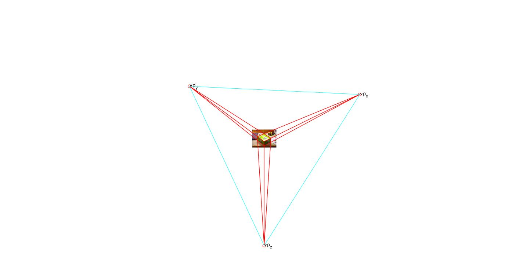
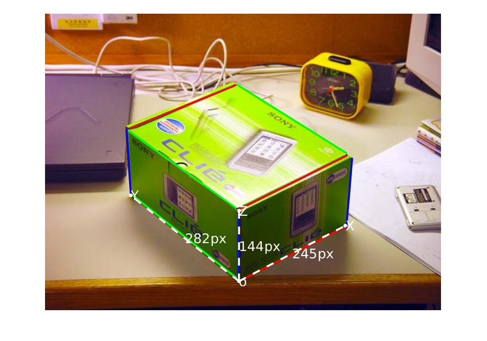
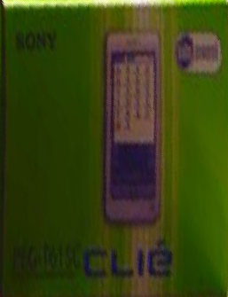
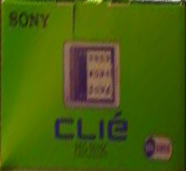

## Single View Geometry for COMP5421 CV Pro 3
### Requirement
> Matlab

### Run
1. Open gui.m
2. Click F5 to run the code

### Pipeline
1. GUI:
> 
2. Load image
3. Add line_x/y/z
4. Compute Vanishing Points
5. Define Reference Points
6. Compute 3D Model
7. Compute Homography Matrix
8. Create Texture Maps

### Result
1. Add parallal line
> 
2. Compute vanishing points(given parallal lines at x/y/z axes)
> 
3. Add reference point(O, X, Y. Z)
> 
4. Create three texture maps
    - XZ
    > 
    - YZ
    > 
    - XY
    > 
5. 3D model
> 

## Demo Video

## Acknowledgement
- Thanks to the guidance of <a href="http://www.cs.ust.hk/~cktang/bio-sketch-review.htm">Prof.C.K.Tang</a> and the patient help from<a href="https://tailei.ram-lab.com/"> Tai lei</a> and Zhekai Tong!

## Remaining Problems
1. not well-structured reconstruction
2. not many testing images

## Useful Link
1. CMU courses and good results: http://www.cs.cmu.edu/~ph/869/results/zhang/asst3/index.html